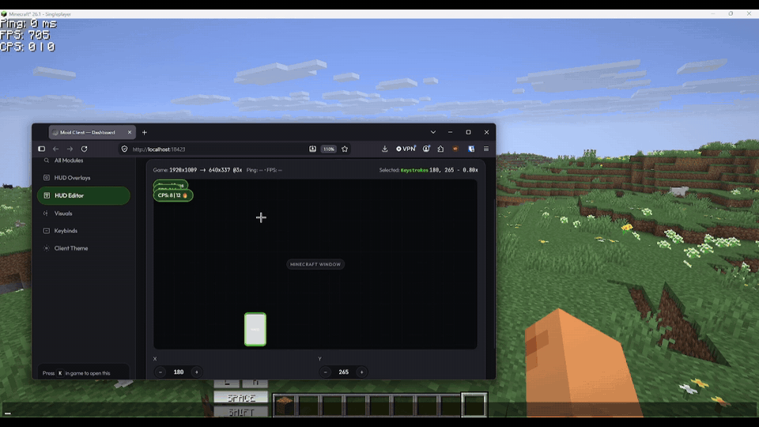

# Moid Client

A lightweight, open-source Fabric client with a clickgui that runs entirely in your browser — no launcher, no login, no telemetry.



## Why Moid?

- **No launcher.** Just a `.jar` — drop it in your `mods` folder like any other Fabric mod.
- **No account login.** Nothing to sign in to, nothing tied to your Microsoft/Mojang account beyond what Minecraft itself needs.
- **No telemetry.** The client doesn't phone home. Don't take my word for it — the code is public, check for yourself.
- **Blocks Mojang telemetry.** On by default: forces vanilla's telemetry off-switch, so analytics events never leave your PC. Logins, skins, and servers work untouched. (Toggling it mid-session settles fully on world rejoin.)
- **Open source (GPLv3).** Fork it, modify it, learn from it — just keep it open if you redistribute it.
- **Browser-based clickgui.** The control panel is a local webpage (`localhost` only), not an in-game overlay — full CSS theming, no fighting Java rendering for a UI.
- **Self-updating.** The dashboard's Updates tab checks GitHub releases on demand, downloads the jar for your Minecraft version with a progress bar, verifies its SHA-256 checksum, and either restarts into it automatically or lets you apply it whenever you like.

## Supported Versions

| Minecraft Version | Fabric Loader | Java | Status |
|---|---|---|---|
| 26.1 – 26.1.2 | >=0.18.0 (tested 0.19.3) | 25 | ✅ Supported |
| 26.2 | >=0.18.0 (tested 0.19.5) | 25 | ✅ Supported |
| 26.3 | >=0.18.0 (tested 0.19.5) | 25 | ✅ Supported |

Requires **Java 25** (Temurin 25+). One jar per Minecraft version — download the one matching your game (`Moid-Client-v1.4.0+26.1.jar`, `...+26.2.jar` or `...+26.3.jar`) from [Releases](../../releases).

## Installation

1. Install [Fabric Loader](https://fabricmc.net/use/) 0.18.0 or newer for your Minecraft version (26.1, 26.2 or 26.3).
2. Download the jar matching your game from [Releases](../../releases) (`Moid-Client-v1.4.0+26.1.jar`, `...+26.2.jar` or `...+26.3.jar`).
3. Drop it into your `.minecraft/mods` folder (with `fabric-api` if not already present).
4. Launch Minecraft. Moid starts a local webserver — press `K` (or check the game log) for `http://localhost:18423` (auto `18423-18450` fallback). Open that URL to access the clickgui.

Config at `.minecraft/config/moidclient.json` (`run/config/moidclient.json` in dev).

## Modules

<!--
Keep this table as the single source of truth for what's implemented.
Add a row per module when you ship it — don't let feature descriptions
drift into the prose sections above.
-->

| Module | Category | Description | Status |
|---|---|---|---|
| FPS Counter | HUD | Displays current frames per second | ✅ |
| TPS Counter | HUD | Displays server ticks per second, colored by health | ✅ |
| Ping HUD | HUD | Displays current server ping | ✅ |
| CPS Counter | HUD | Displays clicks per second | ✅ |
| Keystrokes | HUD | Displays currently pressed movement/action keys | ✅ |
| Coordinates | HUD | Shows your XYZ block position | ✅ |
| Server IP | HUD | Shows the current server address | ✅ |
| Clock | HUD | Shows real time and current world day | ✅ |
| Biome | HUD | Shows the current biome name | ✅ |
| Session Timer | HUD | Tracks playtime (world, server or client scope) | ✅ |
| Potion Effects | HUD | Shows active effects with timers | ✅ |
| Armor Status | HUD | Shows equipped armor with durability | ✅ |
| Fullbright | Visuals | Removes darkness / sets max gamma (1-15) | ✅ |
| Block Outline | Visuals | Custom color/opacity outline on the targeted block | ✅ |
| Perspective Skip | Utility | F5 skips a third-person view — back or front, selectable | ✅ |
| Zoom | Utility | FOV zoom with scroll-adjust, cinematic mode, hold/toggle, rebindable | ✅ |
| FreeLook | Utility | 360° camera + auto third-person, hold/toggle, rebindable | ✅ |
| Custom Hitboxes | Visuals | Always-on entity hitboxes with per-group colors, eye lines | ✅ |
| ToggleSprint | Utility | Uses the vanilla toggle-sprint setting while enabled | ✅ |
| ToggleSneak | Utility | Uses the vanilla toggle-sneak setting while enabled | ✅ |
| Item Physics | Visuals | Dropped items spin in air, lie flat on ground | ✅ |
| Autohide HUD | HUD | Hides the hotbar cluster when idle (slide/shrink/pop, speed, per-direction) | ✅ |
| Telemetry Block | Utility | Blocks Mojang telemetry events, on by default | ✅ |
| Combo Counter | HUD | Consecutive hits without taking damage, peak tracking | ✅ |
| Reach Display | HUD | Distance of your last attack | ✅ |
| Memory Usage | HUD | JVM heap usage, used/max/percent | ✅ |
| Statistics | Utility | Local performance history graphs (dashboard tab) | ✅ |
| Chat Stack | Utility | Stacks repeated chat lines with a [xN] counter | ✅ |

**Planned / in progress:**

| Module | Category | Description |
|---|---|---|
| Crosshair Customization | HUD | Custom crosshair styles, colors, sizes |

## How Moid Compares

| Feature | Moid Client | Lunar Client | Dawn |
|---|---|---|---|
| Open source | ✅ | ❌ | ❌ (open-source libraries used, core client closed) |
| No launcher / no separate login required | ✅ | ❌ | ⚠️ Jar option exists, but launcher is the primary product |
| Browser-based clickgui, real CSS theming | ✅ | ❌ | ❌ (theming "on the way" per their site) |
| No ad-partner data sharing | ✅ | ❌ Confirmed — shares/sells IP, geolocation, behavioral data per their own privacy policy | ❌ Confirmed — automatic telemetry + ad partner integration per their own privacy policy |
| Cosmetic shop | ❌ None | ✅ Yes (capes/emotes, Lunar+) | ⚠️ "Coming soon" |
| Bundled FPS/performance mods | ❌ Not built — see [Performance](#performance) | ✅ Marketed "2x+ boosted frames" | ✅ Rendering/network optimizations claimed |
| Built-in module count | ❌ Handful so far | ✅ 65+ mods | ✅ 100+ mods |
| Established community/Discord | ❌ Just starting out | ✅ Large, active | ✅ Active (inherited from Feather) |
| Anticheat-trusted on major servers | ❌ Not yet | ✅ Widely whitelisted | ✅ Widely whitelisted |

Sources: [lunarclient.com](https://lunarclient.com) and its [privacy policy](https://www.lunarclient.com/privacy); [dawn.gg](https://dawn.gg) and its [privacy policy](https://dawn.gg/privacy), current as of publishing. Check the linked pages yourself — policies change.

## Performance

Moid does not include its own rendering/FPS-optimization mods — that space is already well served by dedicated projects like [Sodium](https://modrinth.com/mod/sodium) and its ecosystem (Iris, Lithium, etc.), and duplicating that work isn't a priority.

Moid's performance goals are scoped to:
1. Not degrading your game's performance — the client itself stays lightweight.
2. Working alongside Sodium and similar optimization mods rather than conflicting with them.

## Building from Source

```bash
git clone https://github.com/moid-m/moidclient.git
cd moidclient
./gradlew :26.3:build # requires Java 25 — jar lands in versions/26.3/build/libs/
./gradlew :26.1:build :26.2:build :26.3:build # all supported versions, one jar each
```

This repo uses [Stonecutter](https://stonecutter.kikugie.dev/): one shared `src/`, one Gradle subproject per Minecraft version (`versions/<mc>/`). Version-specific code goes in `//?` blocks; everything else is shared.

## Roadmap

What's shipped, what's next, and what's parked: see [ROADMAP.md](ROADMAP.md).

## Contributing

Issues and pull requests are welcome. New modules are self-describing: add `definition()` to the module class (see `com.moidclient.module.ModuleDef` / existing `*Hud` / `visuals/*` classes) plus its renderer, a `preview()` for the HUD editor, and one `ModuleRegistry.register()` line — and declare option defaults right in the definition (`bool(key, label, def)`, `slider(..., def)`, etc.): they land in config automatically with zero `ConfigManager` edits (read them back with `ModuleConfig.optBool/optInt/optDouble/optString`). For HUDs also add one `HudElementRegistry.addLast(...)` line in `HudManager.init()` (without it the module shows in the dashboard but never draws) — the dashboard cards, `/api/modules`, and editor previews pick it up automatically, no frontend changes needed (new option types like `keybind` are the only exception).

Stonecutter note: run `./gradlew "Reset active project"` (back to the VCS version, 26.1) before committing, so no preprocessor noise lands in git.

## License

GPLv3 — see [LICENSE](LICENSE). Forks must remain open source under the same license.

## Disclaimer

Not affiliated with Mojang, Microsoft, or any Minecraft server. Use on servers at your own discretion — always check a server's rules regarding client-side modifications.
